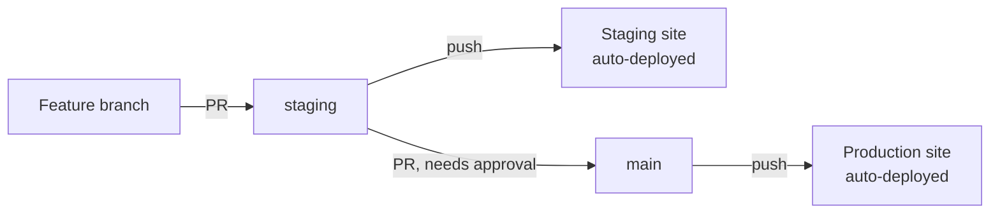

# Deployment & CI/CD

How code goes from a developer's machine to the live site, and how to set it
up again if you're a new developer joining this repo.

---

## Environments

| Environment | URL | Branch | How it updates |
|---|---|---|---|
| **Local** | each teammate's own WordPress install | any | manual, `wp-content/themes/` copy |
| **Staging** | `charliescoffeestaging.site.je` | `staging` | automatic, on push |
| **Production** | `charliescoffee.site.je` | `main` | automatic, on push |

Both staging and production are separate WordPress installs on InfinityFree,
under one hosting account (each is its own "addon domain" with its own
`htdocs/` folder — see the note on folder structure below, it's a common
gotcha with this host).

---

## Branching model



- **`staging`** — open branch, anyone with write access can push directly.
  This is the "try it and see" branch; every push here deploys to the
  staging site automatically.
- **`main`** — protected. No direct pushes (even repo admins are blocked).
  All changes go through a pull request, and the PR needs an approving
  review from a listed [CODEOWNERS](.github/CODEOWNERS) reviewer before it
  can merge. The intended flow is: build on `staging`, test it on the
  staging site, then open a PR into `main` once it's verified working.

---

## CI/CD pipeline (GitHub Actions)

Two workflows live in [`.github/workflows/`](.github/workflows/):

- **`deploy-staging.yml`** — triggers on push to `staging` (only if the push
  touches `coffee-shop/charlies-coffee/`, the theme folder)
- **`deploy-production.yml`** — same, but triggers on push to `main`

Each workflow runs three jobs, in order:

1. **`test`** — lints every `.php` file in the theme with `php -l` (syntax
   check). If any file fails to parse, the job fails and the deploy never
   runs — broken PHP can't reach staging or production.
2. **`ftp-deploy`** (only runs if `test` passes) — uses
   [`SamKirkland/FTP-Deploy-Action`](https://github.com/SamKirkland/FTP-Deploy-Action)
   to FTP-sync `coffee-shop/charlies-coffee/` to the matching site's
   `wp-content/themes/charlies-coffee/` folder — only changed files are
   uploaded, not a full re-upload every time.
3. **`smoke-test`** (only runs if `ftp-deploy` passes) — `curl`s Home,
   Menu, About, and Contact on the *actual live site* and fails the run
   if any of them don't return HTTP 200. This exists because the FTP
   action can report "success" while uploading to the wrong place
   entirely (see the folder-structure gotcha below — that's exactly how
   we found it the first time, the hard way). The smoke test catches
   that class of failure automatically instead of relying on someone
   noticing.

This only keeps the **theme code** in sync. It does not install WordPress,
create pages, set permalinks, activate the theme, or touch the database —
those are one-time manual setup steps per environment (see below).

### Required secrets

Set under repo **Settings → Secrets and variables → Actions**:

| Secret | Used by |
|---|---|
| `STAGING_FTP_SERVER` / `STAGING_FTP_USERNAME` / `STAGING_FTP_PASSWORD` | `deploy-staging.yml` |
| `PROD_FTP_SERVER` / `PROD_FTP_USERNAME` / `PROD_FTP_PASSWORD` | `deploy-production.yml` |

Get these from InfinityFree's Client Area → your hosting account → FTP
Accounts. Values are encrypted by GitHub and never appear in logs or code.

### Checking a deploy

Repo → **Actions** tab → pick the workflow → see every run with full logs.
Green check = deployed successfully, red X = something failed (usually bad
credentials or a changed FTP path).

---

## One-time WordPress setup (per environment)

CI only deploys code — WordPress itself needs this done once per
environment (local, staging, production), each time from scratch:

1. Install WordPress (InfinityFree: Control Panel → Softaculous → WordPress
   → Install Now).
2. wp-admin → **Appearance → Themes** → activate **Charlie's Coffee**.
3. wp-admin → **Pages → Add New** → create pages titled exactly `Menu`,
   `About`, `Contact`.
4. On each page → **Page Attributes → Template** → assign the matching
   template, then publish.
5. wp-admin → **Settings → Permalinks** → select **Post name** → save.
   (Without this, pretty URLs like `/menu/` 404 even though the pages
   exist — this is the most common thing to forget.)
6. wp-admin → **Settings → General** → set Site Title / Tagline (defaults
   to "My Blog" otherwise).

---

## Gotcha: InfinityFree folder structure

If your hosting account has multiple domains under it, FTP does **not**
land you inside a single site's `htdocs/`. Instead, the FTP root shows one
folder per domain, each containing its own `htdocs/`:

```
/ (FTP root)
├── charliescoffee.site.je/
│   └── htdocs/            ← production WordPress root
├── charliescoffeestaging.site.je/
│   └── htdocs/            ← staging WordPress root
└── htdocs/                ← unrelated leftover folder, ignore this one
```

The `server-dir` path in each workflow must include the domain folder name
(e.g. `./charliescoffeestaging.site.je/htdocs/wp-content/themes/charlies-coffee/`).
Using a bare `./htdocs/...` silently uploads to the wrong place — the
Action reports success, but the files never reach the actual site.

---

## Adding a new environment or developer

1. Create a new InfinityFree hosting account/subdomain, install WordPress.
2. Get its FTP credentials, add as new GitHub secrets.
3. Copy one of the existing workflow files, update the secret names and
   `server-dir` path.
4. Run through the one-time WordPress setup above.
