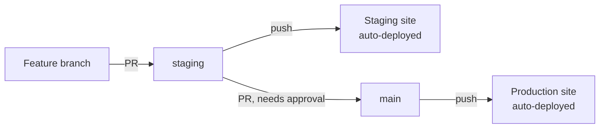

# Deployment & CI/CD

How code goes from a developer's machine to the live site, and how to set it
up again if you're a new developer joining this repo.

---

## Environments

| Environment | URL | Branch | How it updates |
|---|---|---|---|
| **Local** | each teammate's own WordPress install | any | manual, `wp-content/themes/` copy |
| **Staging** | `charliescoffeestaging.atwebpages.com` | `staging` | automatic, on push |
| **Production** | `charliescoffee.app` (via Cloudflare) | `main` | automatic, on push |

Staging and production are on **two separate AwardSpace free hosting
accounts** — AwardSpace's free tier only includes 1 hosted domain and 1
MySQL database per account, so each environment gets its own account rather
than sharing one. Production's domain is fronted by Cloudflare; see
[Why Cloudflare is in front of production](#why-cloudflare-is-in-front-of-production)
below for why that's necessary, not optional.

---

## Branching model



- **`staging`** — open branch, anyone with write access can push directly.
  This is the "try it and see" branch; every push here deploys to the
  staging site automatically.
- **`main`** — protected. No direct pushes (even repo admins are blocked).
  All changes go through a pull request, and the PR needs an approving
  review from a listed [CODEOWNERS](.github/CODEOWNERS) reviewer before it
  can merge. The intended flow is: build on `staging`, test it on the
  staging site, then open a PR into `main` once it's verified working.

---

## CI/CD pipeline (GitHub Actions)

Two workflows live in [`.github/workflows/`](.github/workflows/):

- **`deploy-staging.yml`** — triggers on push to `staging` (only if the push
  touches `coffee-shop/charlies-coffee/`, the theme folder)
- **`deploy-production.yml`** — same, but triggers on push to `main`

Each workflow runs three jobs, in order:

1. **`test`** — lints every `.php` file in the theme with `php -l` (syntax
   check). If any file fails to parse, the job fails and the deploy never
   runs — broken PHP can't reach staging or production.
2. **`ftp-deploy`** (only runs if `test` passes) — uses
   [`SamKirkland/FTP-Deploy-Action`](https://github.com/SamKirkland/FTP-Deploy-Action)
   to FTP-sync `coffee-shop/charlies-coffee/` to the matching site's
   `wp-content/themes/charlies-coffee/` folder — only changed files are
   uploaded, not a full re-upload every time.
3. **`smoke-test`** (only runs if `ftp-deploy` passes) — `curl`s Home,
   Menu, About, and Contact on the *actual live site* and fails the run
   if any of them don't return HTTP 200. This exists because the FTP
   action can report "success" while uploading to the wrong place
   entirely (see the folder-structure gotcha below — that's exactly how
   we found it the first time, the hard way). The smoke test catches
   that class of failure automatically instead of relying on someone
   noticing.

This only keeps the **theme code** in sync. It does not install WordPress,
create pages, set permalinks, activate the theme, or touch the database —
those are one-time manual setup steps per environment (see below).

### Required secrets

Set under repo **Settings → Secrets and variables → Actions**:

| Secret | Used by |
|---|---|
| `STAGING_FTP_SERVER` / `STAGING_FTP_USERNAME` / `STAGING_FTP_PASSWORD` | `deploy-staging.yml` |
| `PROD_FTP_SERVER` / `PROD_FTP_USERNAME` / `PROD_FTP_PASSWORD` | `deploy-production.yml` |

Get these from AwardSpace's control panel → **FTP Manager** → your FTP
account → **Information** (this shows the hostname and username; the
password is only visible if you set it yourself, AwardSpace never displays
an existing one). Values are encrypted by GitHub and never appear in logs
or code.

### Checking a deploy

Repo → **Actions** tab → pick the workflow → see every run with full logs.
Green check = deployed successfully, red X = something failed (usually bad
credentials or a changed FTP path).

---

## One-time WordPress setup (per environment)

CI only deploys code — WordPress itself needs this done once per
environment (local, staging, production), each time from scratch:

1. Install WordPress (AwardSpace: control panel → **Zacky App Installer**
   → WordPress → fill in Step 2's admin account details → Install
   Application).
2. wp-admin → **Appearance → Themes** → activate **Charlie's Coffee**.
3. wp-admin → **Pages → Add New** → create pages titled exactly `Menu`,
   `About`, `Contact`.
4. On each page → **Page Attributes → Template** → assign the matching
   template, then publish.
5. wp-admin → **Settings → Permalinks** → select **Post name** → save.
   (Without this, pretty URLs like `/menu/` 404 even though the pages
   exist — this is the most common thing to forget.)
6. wp-admin → **Settings → General** → set Site Title / Tagline (defaults
   to "My Blog" otherwise).

---

## Gotchas: AwardSpace hosting

**FTP root has one folder per domain.** Same idea as most shared hosts —
the FTP root isn't a single site's document root, it's one folder per
hosted domain/subdomain:

```
/ (FTP root, e.g. /home/www/)
├── charliescoffee.app/
│   └── wp-content/themes/charlies-coffee/   ← production theme folder
└── charliescoffeestaging.atwebpages.com/
    └── wp-content/themes/charlies-coffee/   ← staging theme folder
```

The `server-dir` path in each workflow must include the domain folder name.
Using a bare `./wp-content/...` silently uploads to the wrong place.

**The FTP-Deploy-Action won't create the base `server-dir` folder itself.**
It only creates *subfolders inside* an already-existing base directory. On
a brand-new WordPress install, `wp-content/themes/charlies-coffee/` doesn't
exist yet — if you run the deploy before creating that folder, it fails
partway through with `FTPError: 550 assets: No such file or directory`
(it successfully creates the first-level folder, then fails trying to
create a folder inside it, because the base folder was never really
there). Fix: manually create the empty `charlies-coffee` folder via
AwardSpace's File Manager once, before the first deploy to a fresh install.

**Free tier = 1 domain + 1 database per account.** This is why staging and
production live on two separate AwardSpace accounts instead of one. If a
domain/database limit is hit while setting up a new environment, either
free up the existing one or sign up for another free account — don't
assume you need to pay to get a second environment working.

**AwardSpace expects full nameserver control to keep hosting a domain.**
If you add a domain under "Host a Domain" but don't point its nameservers
at AwardSpace's own (`ns5.awardspace.com` / `ns6.awardspace.com`), it will
eventually mark the domain "not replicated" and can silently un-host it —
the WordPress files and Zacky installation record get wiped, even though
the database usually survives. This is exactly why production needs
Cloudflare instead (see below) rather than pointing nameservers straight
at AwardSpace.

---

## Why Cloudflare is in front of production

`charliescoffee.app` is fronted by Cloudflare (DNS + SSL), while staging
(`charliescoffeestaging.atwebpages.com`) is not. This isn't stylistic — it
solves a real conflict between two requirements that can't both be met by
AwardSpace's free tier alone:

- **`.app` is on the browser HSTS-preload list.** Every browser refuses
  plain HTTP for any `.app` domain, no exceptions, no "proceed anyway."
  The domain **must** serve valid HTTPS.
- **AwardSpace's free plan has no SSL certificate option** for a custom
  domain (it's a paid-plan-only feature). Without it, `charliescoffee.app`
  would be completely unreachable in a real browser.

Cloudflare's free tier does provide HTTPS termination at its edge, so it
sits in front purely for that reason:


- SSL/TLS mode is set to **Flexible**: Cloudflare terminates HTTPS with the
  visitor using its own certificate, then talks to the AwardSpace origin
  over plain HTTP. The origin never needs its own valid certificate.
- The trade-off: Cloudflare can't be combined with AwardSpace's "point
  your nameservers at us" requirement (above) without the domain
  eventually losing its hosting. In practice this means production's
  nameservers stay on Cloudflare permanently, and the domain may need to
  be manually re-hosted + re-deployed on AwardSpace occasionally if it
  gets flagged as "not replicated" — this is a known trade-off of the
  free-tier setup, not a bug.
- Staging doesn't need any of this, since `atwebpages.com` isn't on the
  HSTS-preload list — plain HTTP is acceptable there, so staging points
  its nameservers straight at AwardSpace with no Cloudflare involved.

---

## Workflow & tooling comparison

Several alternatives were tried and rejected before landing on the current
setup. This is real project history, not a hypothetical comparison.

### Hosting

| Option | Pros | Cons | Verdict |
|---|---|---|---|
| **InfinityFree** (original) | Free, multi-domain support, was already working | Confirmed blocked provider-wide on JCU's network — a hard access failure for anyone marking from campus | **Rejected** |
| **AwardSpace** (chosen) | Free, confirmed reachable from JCU's network | Free tier requires full nameserver control to stay hosted; no SSL for custom domains | **Chosen**, paired with Cloudflare to cover the SSL gap |
| **Paid hosting** (e.g. Hostinger) | Full control, SSL included, no free-tier quirks | Real cost, unnecessary for this assignment's scope | **Rejected** |

### Domain

| Option | Pros | Cons | Verdict |
|---|---|---|---|
| **Free host subdomain** (`.site.je` / `.atwebpages.com`) | Zero cost, zero setup | Unprofessional, tied to whichever host is used | Fine as a fallback, not as the primary domain |
| **GitHub Student Pack → Namecheap** | Free via student benefit | Didn't work reliably on JCU's network in testing | **Rejected** |
| **GitHub Student Pack → Name.com** (chosen) | Free via student benefit, worked correctly on JCU's network | `.app` TLD enforces mandatory HTTPS (drove the Cloudflare requirement) | **Chosen** — `charliescoffee.app` |

### Cloudflare vs no Cloudflare (production)

| | With Cloudflare (chosen) | Without Cloudflare |
|---|---|---|
| HTTPS on `charliescoffee.app` | Works — free certificate at Cloudflare's edge | Fails — AwardSpace's free tier has no cert for custom domains |
| Browser access | Loads normally | Blocked outright (`.app` requires HTTPS everywhere) |
| Setup complexity | Slightly more (DNS proxying, SSL mode config, occasional re-hosting) | Simpler, but non-functional |
| Verdict | **Necessary** | Not viable for this domain |

**Summary:** the site needed a host reachable from JCU networks (ruling
out InfinityFree) and valid HTTPS for a `.app` domain (which AwardSpace
alone can't provide for free). Combining AwardSpace for hosting with
Cloudflare purely for HTTPS satisfies both constraints without paying for
anything.

---


