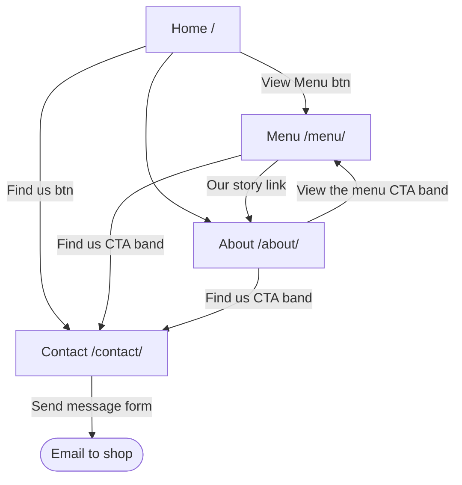
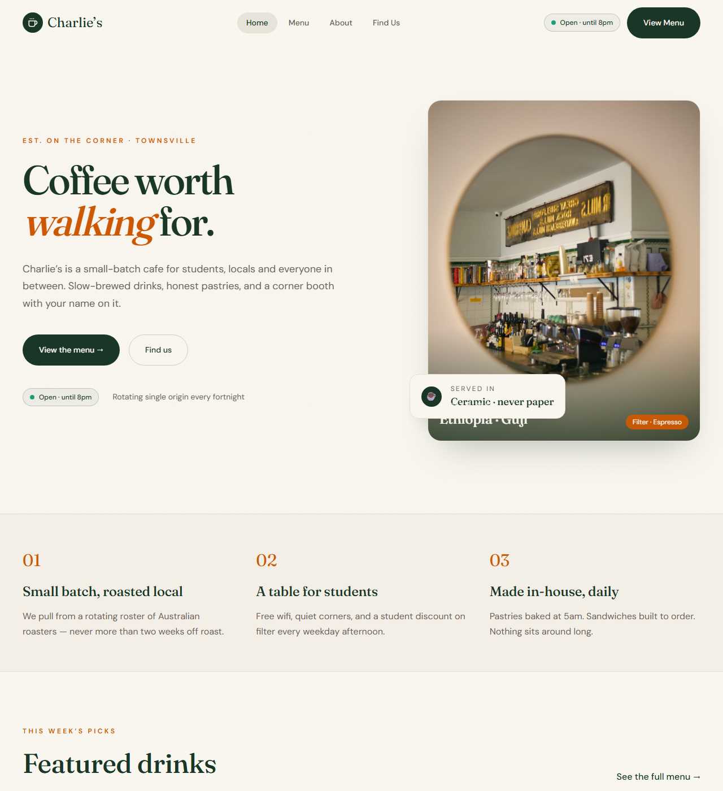
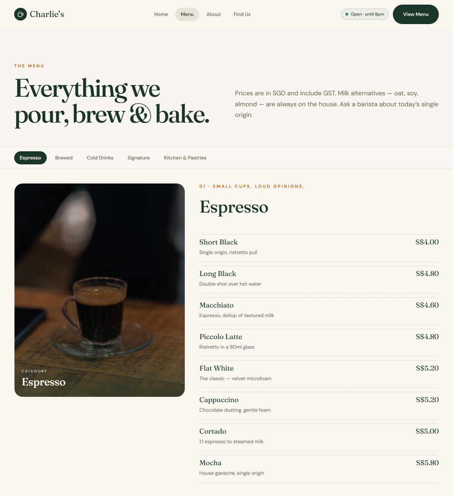
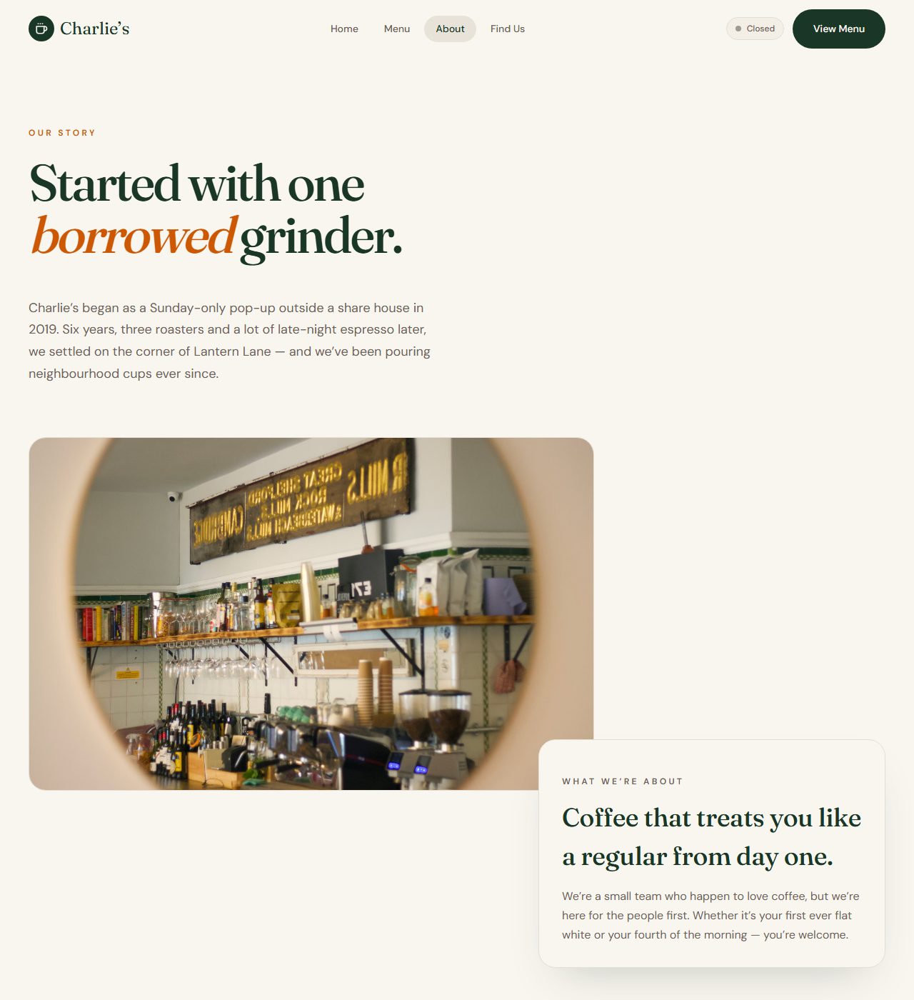
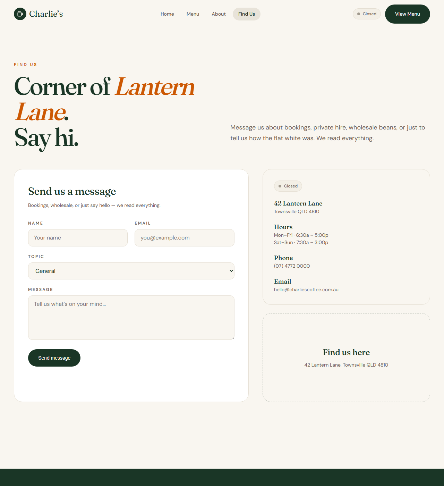

# Design Reference — Charlie's Coffee

This documents the current, actual design of the site — screenshots of the
real theme running locally (same theme code as staging/production, see
[project.html](../project.html)). This is a reference of what's built, not a
pre-development wireframe: the theme was built directly rather than mocked
up in a separate design tool first.

---

## Information architecture

Every page reachable from primary nav (Home / Menu / About / Find Us), and
every page ends in a CTA band pushing toward **Menu** or **Contact** — no
dead ends.

## Calls-to-action by page

| Page | Primary CTA(s) | Where |
|---|---|---|
| Home | **View the menu**, **Find us** | Hero (top), and CTA band (bottom) |
| Menu | **Find us**, **Our story →** | CTA band (bottom), after full price list |
| About | **View the menu →**, **Find us** | CTA band (bottom) |
| Contact | **Send message** (form submit) | Main content — the page's entire purpose |

Matches the three main CTAs stated in the project goals: *View Menu · Find
Us · Contact Us*.

---

## Page screenshots

### Home

### Menu

### About

### Contact

