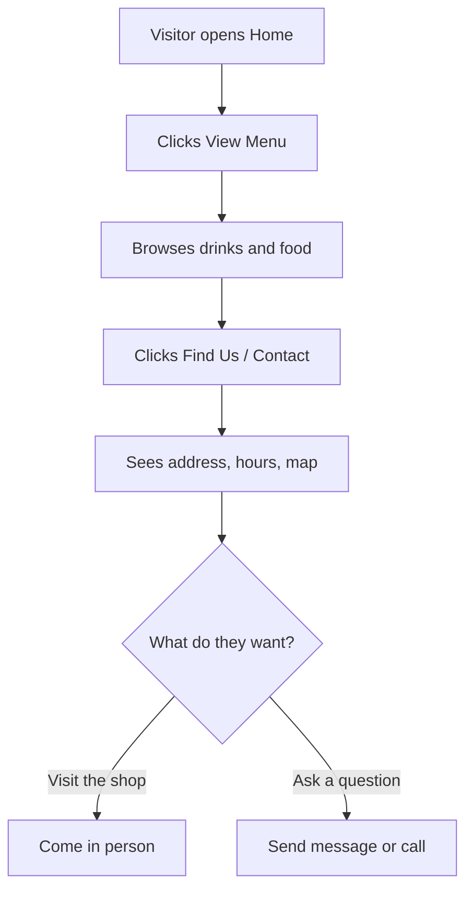
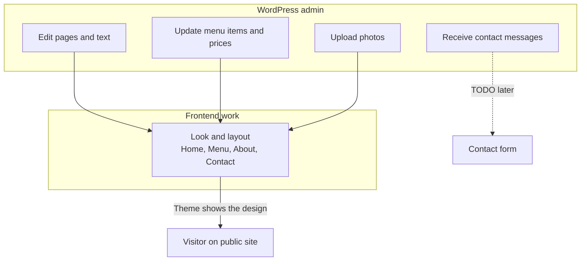
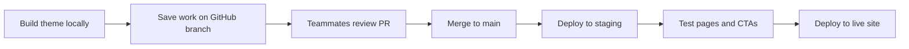

# Coffee Shop Website — How It Works

Team Charlie · CP3402

This file explains our project in simple words: what we are building, how a visitor uses the site, and how our team will build and launch it.

---

## What are we building?

A **coffee shop brochure website** (not an online shop).

Visitors can:

1. Discover the shop on the Home page
2. Browse the **Menu**
3. Read **About** the shop
4. **Find Us / Contact** the shop

There is **no** add to cart, checkout, online payment, or order confirmation.

### Pages (what visitors see)

- Home
- Menu
- About
- Contact / Find Us

### Main CTAs (calls to action)

| Page | Main button |
|------|-------------|
| Home | View Menu |
| Menu | Find Us |
| About | Contact Us |
| Contact | Send message / Call us |

---

## Visitor journey (simple)

### Step-by-step

1. Visitor lands on Home and understands it is a coffee shop.
2. They click **View Menu** and check prices/items.
3. They click **Find Us** or **Contact Us**.
4. They visit the shop in person, or contact the shop.

No online order is created.

---

## Frontend vs WordPress content

In short:

- **Frontend** = how the site looks and how pages are laid out
- **WordPress admin** = where teammates edit text, menu, and photos
- Visitors never need an account

---

## Team roles 

| Role | Focus |
|------|--------|
| Frontend | Theme UI, CSS, responsive layout, CTAs |
| Content / WP | Pages, menu text, images in admin |
| DevOps | Local + staging + production, Git workflow |
| Docs / PM | `theme.md`, `site.md`, `deployment.md`, project board |

---

## How our team will build and publish the site

### Build order

1. Shared layout (header, footer, navigation, buttons)
2. Home page (hero + main CTA: View Menu)
3. Menu page (coffee / food sections + prices)
4. About page
5. Contact / Find Us page (hours, address, map placeholder, form UI)
6. Make it mobile-friendly
7. Connect theme to WordPress (menus, pages, images)
8. Put content in WordPress admin
9. Test on local → staging → live
10. Write docs: `theme.md`, `site.md`, `deployment.md`, `project.html`

---

## Frontend TODOs for later WordPress / backend wiring

| Item | TODO |
|------|------|
| Navigation | Replace hard-coded nav with WordPress menu |
| Home hero text / CTA | Make editable in page editor or Customizer |
| Menu items and prices | Load from WordPress content (not only static HTML) |
| Photos | Use WordPress Media Library images |
| Hours and address | Make editable in admin |
| Map | Replace placeholder with real map embed |
| Contact form | Connect to form plugin or email handler |

---

## What shop staff can do

In WordPress admin, staff / teammates can:

- Edit Home, Menu, About, Contact pages
- Update menu items, prices, and photos
- Update opening hours and address
- Check contact form messages (once form is connected)

They do **not** need a separate shop dashboard.

---

## Environments (Assessment requirement)

| Environment | Purpose |
|-------------|---------|
| **Local** | Build and test on each computer |
| **Staging** | Test before going live |
| **Production** | Public live website |

---
