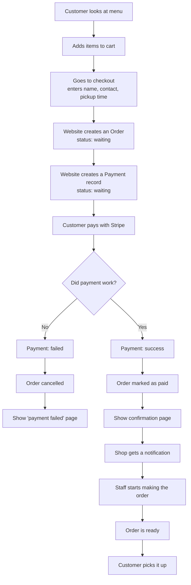
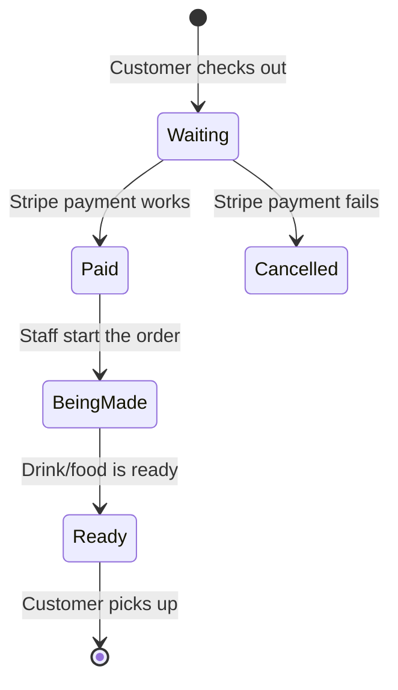
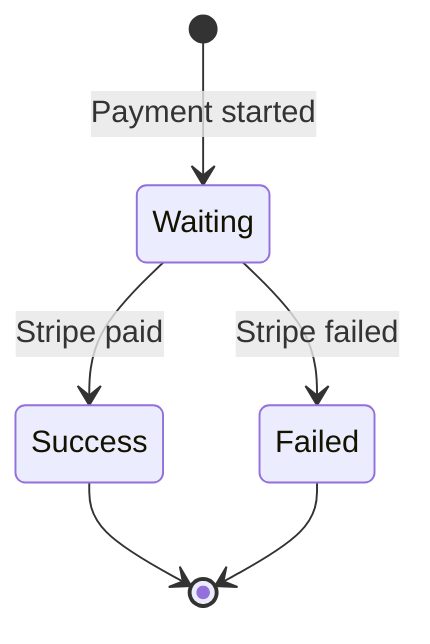
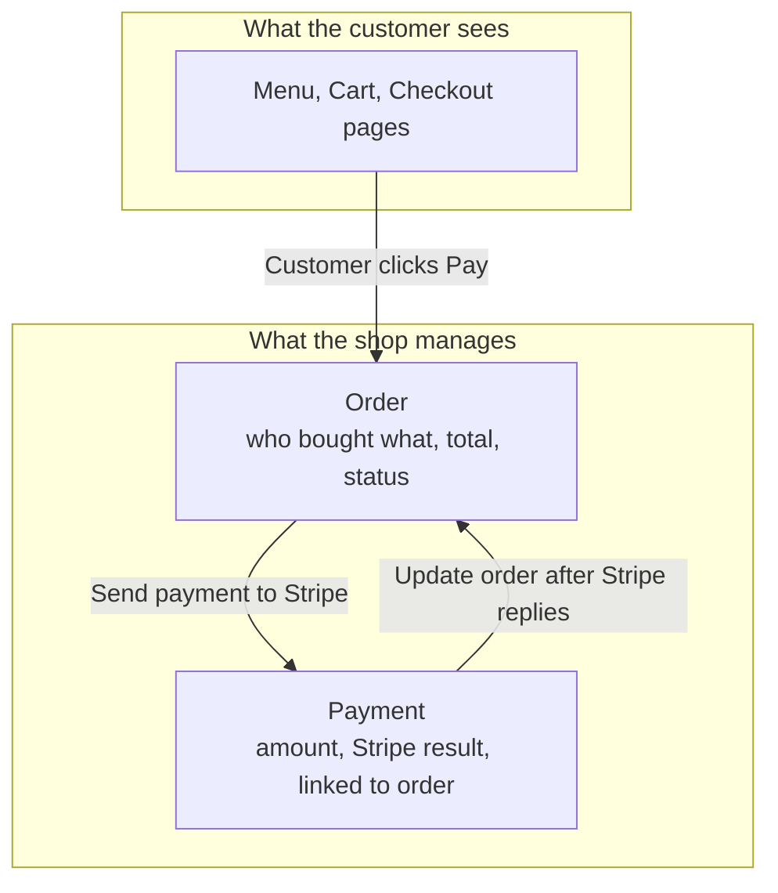
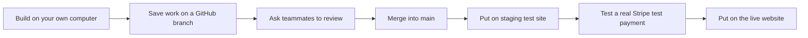

# Coffee Shop Website — How It Works

Team Charlie · CP3402

This file explains our project in simple words: what we are building, how a customer buys coffee online, and how our team will build and launch the site.

---

## What are we building?

A **coffee shop website** where customers can:

1. Look at the menu
2. Add drinks/food to a cart
3. Pay online with **Stripe**
4. Pick up their order at the shop

### Front of the website (what customers see)

- Home page
- Menu
- Cart and checkout
- Order confirmation page

### Back of the website (what the shop manages)

We only focus on two things:

- **Orders** — what the customer bought
- **Payments (transactions)** — whether they paid successfully with Stripe

### What we are NOT building

We will not build:

- Loyalty points
- Stock / inventory tracking
- Staff timetables
- A full shop POS system
- Subscriptions or complex Stripe features

---

## What information do we store?

### Menu items

Each drink or food item has:

- Name
- Price
- Photo
- Category (Coffee, Food, or Merch)

### Orders

An order is the customer’s purchase. It stores:

- Who ordered
- What they bought
- Total price
- Order status (waiting, paid, making, ready, or cancelled)

### Payments (transactions)

A payment record stores:

- How much was paid
- That Stripe was used
- Whether payment worked or failed
- Which order it belongs to

---

## What happens when a customer buys something?

Think of it like ordering coffee, but online.

### Simple step-by-step

1. Customer opens the menu and adds items to the cart.
2. Customer goes to checkout and enters their details (name, phone or email, pickup time).
3. The website creates an **order** and a **payment record** (both start as “waiting”).
4. Customer pays with **Stripe** (card payment).
5. **If payment works:** payment is marked success, order is marked paid, customer sees a confirmation, and the shop is notified.
6. **If payment fails:** payment is marked failed, order is cancelled, customer sees an error message.
7. Staff make the order, mark it ready, and the customer picks it up.

---

## Order status (easy view)

An order moves like this:

**Waiting → Paid → Being made → Ready → Picked up**

If payment fails, it becomes **Cancelled**.

## Payment status (easy view)

A payment is only one of these:

- **Waiting** — customer started checkout
- **Success** — Stripe took the money
- **Failed** — card payment did not work

---

## Front end vs back end (one purchase)

In short:

- The **customer** uses the website pages.
- The **shop** sees orders and payment results in WordPress admin.

---

## How our team will build and publish the site

### Build order (do these in order)

1. Make the basic coffee shop pages (Home, Menu, Cart, Checkout, Contact)
2. Add menu items (drinks/food) as products
3. Make cart and checkout work
4. Make sure orders are saved
5. Connect Stripe in **test mode**
6. Let staff view orders and change status in admin
7. Send a notice when a new paid order arrives
8. Test both success and failed payments
9. Publish the site and write our docs (`theme.md`, `site.md`, `deployment.md`)

---

## Stripe setup (checklist)

1. Make a Stripe account
2. Install WooCommerce in WordPress
3. Install the Stripe plugin for WooCommerce
4. Add Stripe test keys (safe fake-money mode)
5. Set up Stripe so WordPress knows when payment finished
6. Test with Stripe’s test card: `4242 4242 4242 4242`
7. Only switch to real (live) keys after testing works

---

## What shop staff can do

In the WordPress admin, staff can:

- See all orders (customer, items, total, time)
- See if Stripe payment worked
- Change order status (for example: Being made → Ready)
- Run the shop day-to-day **without** editing website code

---

